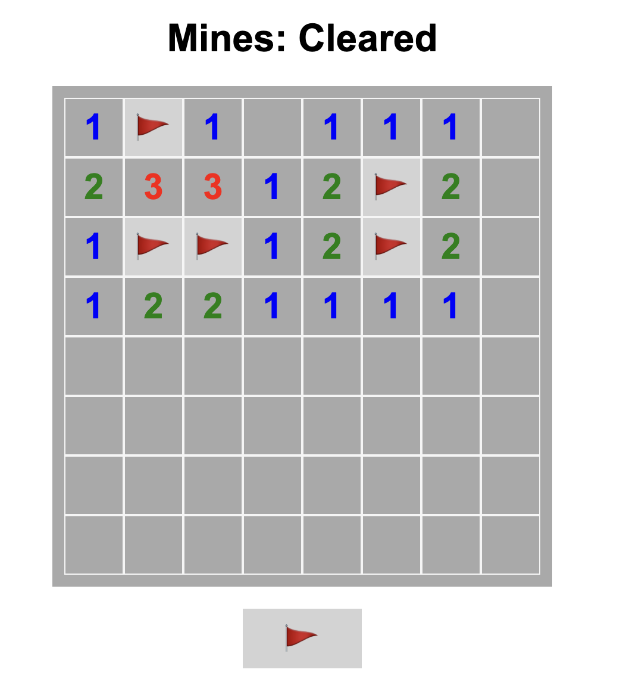

# マインスイーパーゲーム

JavaScriptでゲームを制作しました。

# 工夫したところ

### ゲームの流れ
1.ゲームの開始・window.onload

2.地雷の位置の設定・setMines()

3.タイルをクリックしたら時・clickTile()

4.タイルのチェック・checkMine(r, c)

5.ゲームオーバー時にすべての地雷を表示・revealMines()

6.すべての安全なマスを開いたらクリア ・Cleared
